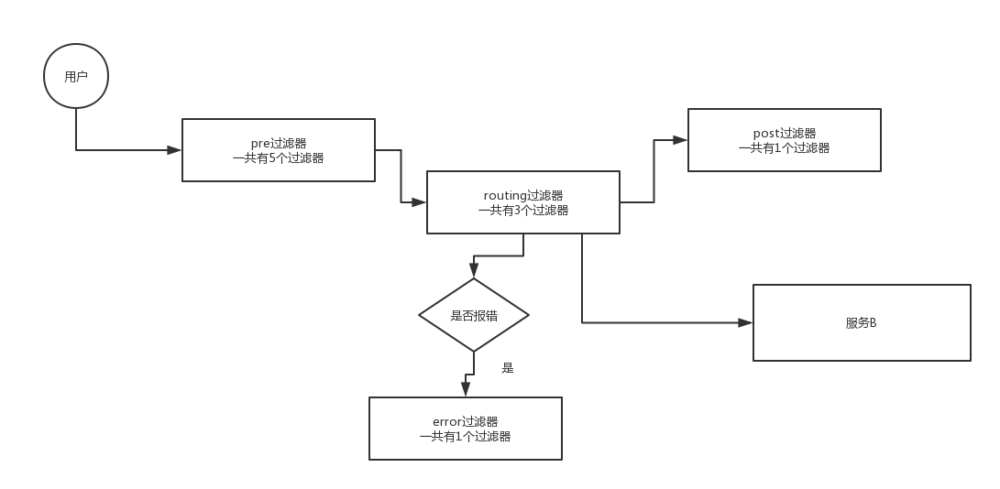
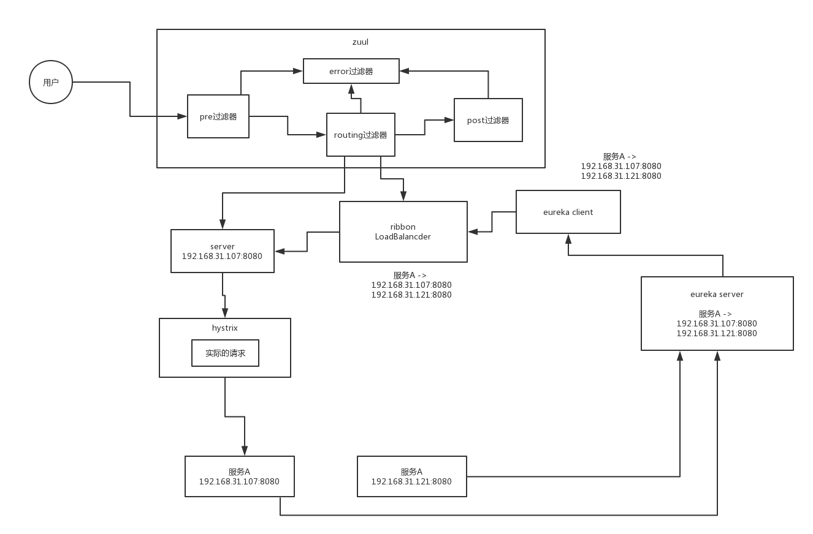

### 129. 微服务架构里的网关作用 - 门面模式
1. 请求路由: 屏蔽后台系统的大量服务, 给前端一个统一接口
2. 统一处理: 所有后台服务器都要做的通用的事情, 交给网管处理
    - 安全验证
    - 限流, 降级, 熔断, 超时
    - 异常处理
    - metrics统计
    
### 130. zuul demo

问题: zuul怎么知道eureka地址的


### 132. zuul核心工作原理: 责任链模式的各种filter



### 133. zuul的主要功能:
1. 简单路由: 配置映射, 直接配一个service的地址, 然后就转到哪里去了.
2. 跳转路由: 在自己的controller里套转一下
3. ribbon路由: 基于ribbon+eureka, 把请求路由到负载均衡后的service.
4. 自定义路由规则: 实现PatternServiceRouteMapper, 把指定的请求路由到自己想要的服务.
5. 可以自定义忽略某些路径路由: 使用ignoredPatterns属性配置. 

### 134. Zuul的常见配置: 请求头, 路由映射, hystrix, ribbon
1. 请求头拦截: 
    可以拦截一些敏感的请求头, 不转发给后端service
    `sensitiveHeaders: xxx, xxx`
2. 路由映射信息页面:
    引入actuator, 关闭"management.security.enabled=false", 可以在/routes路径下看.
3. hystrix 配置:
    zuul和ribbon整合转发的时候, 使用ribbonRoutingFilter, 使用hystrix包裹请求转发. 进行降级什么的需要实现
    ZuulFallbackProvider, 提供fallback逻辑
4. ribbon客户端预加载:
    zuul.ribbon.eager-load.enabled=true
5. 超时配置: 
    超时配置要考虑hystrix和ribbon. 
    hystrix超时计算公式: `ribon.connectTimeout + ribbon.readtimeout*(ribbon.maxAutoRetries + 1)*(ribbon.maxAutoRetriesNextServer + 1)`
    
### 135. zuul高级功能: 过滤器优先级, 自定义过滤器
#### 过滤器优先级
- pre过滤器
```java
-3：ServletDetectionFilter
-2：Servlet30WrapperFilter
-1：FromBodyWrapperFilter
1：DebugFilter
5：PreDecorationFilter
```
- routing过滤器
```java
10：RibbonRoutingFilter
100：SimpleHostRoutingFilter
500：SendForwardFilter
```
- post过滤器
```java
1000：SendResponseFilter
```
- error过滤器
```java
0：SendErrorFilter
```

#### 自定义过滤器
制作filter bean, 继承ZuulFilter.

2. 可配置动态加载过滤器
3. 可配置禁用过滤器: 
    `sendForwardFilter.route.disable=true`
4. requestContext:
    在filter中, 可以用RequestContext.getCurrentContext(), 拿到web服务的各种.
5. @EnableZuulServer:
    禁用filter
6. error过滤器:
    在自定义过滤器里抛自定义异常, 然后创建ErrorController来捕获和统一处理.
    
    
### 136. zuul在spring-cloud环境下的核心原理图
zuul核心就是, 接收到请求, 根据yml和filter配置, 把请求和服务URL对应上.
使用hystrix做熔断降级, ribbon做负载均衡, eureka做服务发现.



### 137. spring cloud源码中的zuul过滤器包


